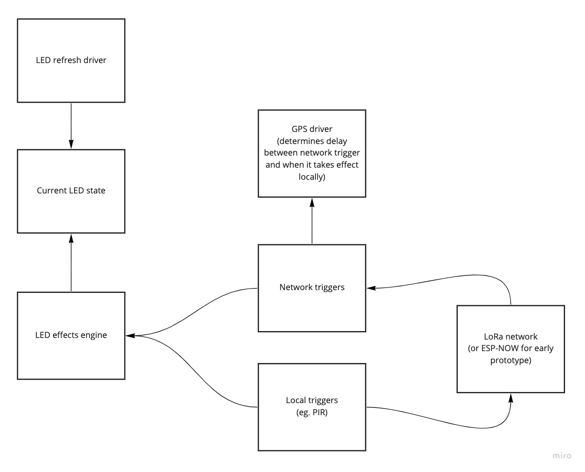

# LoRa Lamps

A very early-stage personal art project.

Targets ESP32 microcontrollers running Micropython, using GPS and LoRa network.

## High-level software architecture

# Tools

Visual Studio Code + Pymakr is being used for development.

Note that autocompletion and linting is happier with micropython stubs installed via:
`pip3 install micropython-esp32-stubs`

Python files are auto-formatted with Black.

rshell is used to sync files onto the boards.

# Boards

### Microcontrollers

Everything is on ESP32.

Currently using:
- an old generic WROOM devkit
- a couple of first-generation TinyPico boards
- some Wemos Lolin D3 Mini boards 
- some Lilygo TTGO LoRa32 boards (primary target)

### GPS

Using NEO-6M GPS units (serial uart)

### Networking

Initially ESP-NOW, but intending to move to LoRa once more boards arrive.

This repo contains some custom micropython firmware builds that add the experimental ESP-NOW support.
